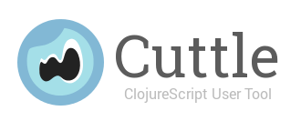

Cuttle is a standalone application that aims to be __the simplest way to use
ClojureScript__.  It provides a user-friendly interface, allowing you to build
projects by clicking a button, and to see meaningful warnings and errors at a
glance.  In a way, it provides the "builder" parts of an IDE without making you
leave your favorite editor.

 

Under the hood, Cuttle is not hiding a lot of magic from you.  It uses standard
ClojureScript workflow tools to perform its operations.  It uses Leiningen with
the lein-cljsbuild plugin listed in your project.clj, and the mies template for
creating new projects.  Thus, it should produce the same expected behavior as
these standard tools.

Cuttle is itself a ClojureScript application :) (running on a Node/Chromium
framework called Atom Shell). We hope this tool encourages you to explore
building ClojureScript apps for the browser, Node, and other JS-targetted
platforms.

## Installation

 [Windows Installer](https://github.com/oakmac/cuttle/releases/download/v1.1/cuttle-v1.1-windows.exe)  
 [Mac DMG](https://github.com/oakmac/cuttle/releases/download/v1.1/cuttle-v1.1-mac.dmg)  
 [Linux zip](https://github.com/oakmac/cuttle/releases/download/v1.1/cuttle-v1.1-linux-x86_64.tar.gz)


(Please make sure to install a [JRE >= 7](http://www.oracle.com/technetwork/java/javase/downloads/jre8-downloads-2133155.html))

## User Guide

- When first opening Cuttle, you will be prompted to add an existing project or
  to create a new one.
- __Add Existing Project__: If you are adding an existing project, you must
  navigate the presented dialog to the project's `project.clj` file so that we
  can find your configured builds.
  - (We currently do not support cljsbuild configurations outside of the
    default `:dev` profile).
- __Add New Project__: If you are creating a new project, you will be prompted
  for a name and location for its folder.
  - (The standard `lein new mies` template will be used to create the project.)
- __Build Table__: Once you have loaded a project, you will be presented with a
  table of build configurations available for that project. Current status of
  the build, along with warnings and errors will be displayed here.
- __Build Button__: At the top-right of the build table, you should see a build
  button.  You can first select the dropdown arrow to specifically set which
  builds to compile and whether or not to automatically recompile when files
  change.  Click the button proper to start building.
- __Multiple Projects__: You can add multiple projects to this workspace.  The
  projects are treated with isolated compiler instances and can be built in
  parallel.
- __Project Buttons__: The project buttons at the top-left of the build table
  are also helpful for opening the project folder, re-fetching the build
  configs, and removing the project from the workspace.
- __Notifications__: The settings link at the top-right of the page currently
  holds options for toggling compiler notifications
  - (via Mac native Notifications, Linux `notify-send`, or Growl For Windows).
- __Shutting Down__: When closing the application, all compiler instances that
  happen to still be running are shutdown.  Your configurations are saved and
  reloaded when re-opening the application.


## Future

We welcome your ideas, bug reports, and pull requests!

With the ClojureScript tooling community rapidly growing, we hope to keep
improving the user experience to integrate new workflows, while also keeping
its behavior simple and predictable.  Some ideas we are thinking about:

- [Integration with Figwheel](https://github.com/oakmac/cuttle/issues/53)
- a basic REPL for experimenting
- [a full project-connected REPL](https://github.com/oakmac/cuttle/issues/54)
- an interface for reading/modifying project.clj
- [a test-runner for cljs.test](https://github.com/oakmac/cuttle/issues/28)

## Development Setup

To setup a environment for building Cuttle:  (you can replace the `lein` bits
with Cuttle :P)

1. Install [Leiningen] and [Node.js].
1. One-time setup. Run from the project directory:

    ```sh
    # setup on linux/mac
    scripts/setup.sh

    # setup on windows
    scripts/setup.bat
    ```

1. Compile when files change:

    ```sh
    # compile LESS file
    grunt less

    # compile ClojureScript files (this may take a minute)
    lein cljsbuild once
    ```

1. Launch to try it out:

    ```sh
    # launch on Mac/Linux/Cygwin
    scripts/launch.sh

    # launch on Windows
    scripts/launch.bat
    ```

1. Assemble a release (can only do this for your OS):

    ```sh
    # Create a release folder
    ./release.sh

    # Create a release zip
    ./release.sh -z
    ```

## About the Name/Logo

Cuttle is named after the [Cuttlefish] because [Shaun] likes cephalopods.
The logo is modeled after its uniquely shaped [eye].

The first three letters of Cuttle might stand for "ClojureScript User Tool", but
the last three letters don't stand for anything because Cuttle is not an
acronym.

Cuttle should be capitalized like a proper noun when used in a sentence.

## License

All code licensed under the terms of the [MIT
License](https://github.com/oakmac/cuttle/blob/master/LICENSE.md).

[Leiningen]:http://leiningen.org
[Node.js]:http://nodejs.org
[Atom Shell]:https://github.com/atom/atom-shell
[Cuttlefish]:https://flic.kr/p/8oVLuC
[Shaun]:https://github.com/shaunlebron
[eye]:http://mentaldstruction.deviantart.com/art/Baby-Cuttlefish-112140710
